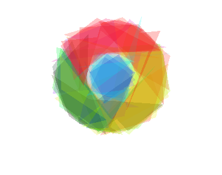
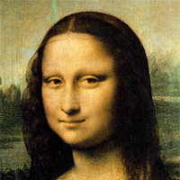
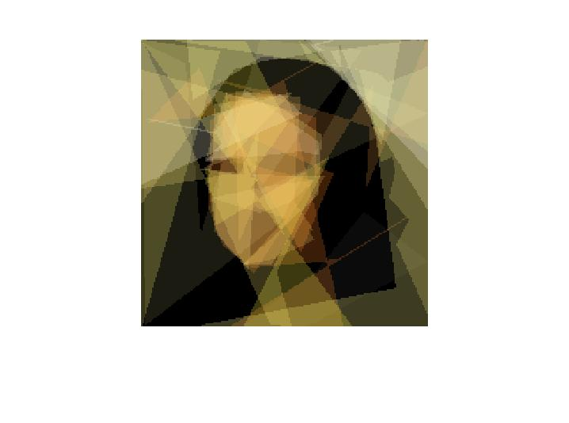

# Genetic-programming

----------

首先贴一个大神的作品，很多年前的了，是使用C#完成的，比较有意思：[Genetic Gallery](https://rogeralsing.com/2008/12/11/genetic-gallery/).
自己看了他的C#代码，决定使用MATLAB重新实现以下，本来是想自己或许可以借助MATLAB数学计算的能力优化一下处理速度，结果没想到最后只是勉强把效果实现了。因为虽然MATLAB在处理矩阵时很快，但是MATLAB中并没有像C#中`canvas`类里这样对图像可画可取的操作方式（此处存疑，因为我自己在网上找了一圈没找到，如果有大神读了代码，发现可以改进的地方希望告知），所以只能是自己操作一个矩阵，来实现类似的功能：
1. 绘制多边形：主要步骤是两顶点画一条直线；将各条线组合形成一个多边形；使用MATLAB的方法`imfill`将多边形填充；将填充区域扩展到3维，形成`RGBA`的图像。
2. 多边形叠加形成图片：根据RGBA图像合成的计算公式，计算得到各个多边形叠加到最后的图像。
3. 计算适应度：就是计算绘制的图像矩阵和源图像矩阵在每个像素点上rgb的之差的平方之和。

>1,2是在`drawImg`方法中完成的，3在是`calculateFitness`方法中完成的。
其中`drawImg`方法计算耗时最长，也是最需要优化的地方。

所以目前来讲，对于一些简单的图像在相对较短的时间内还是可以等到很好的效果的：

但是对于稍微复杂的就有点不太好了，需要的时间较长;

----------

### 如何使用：

考虑到性能问题，就没有增加gui，所以直接执行`main`脚本；如果一次执行时间太长，想中断看下情况如何，可以直接`Ctr+C`，然后执行`save`，将当前状态保存（下次使用main的时候就可以接着上次的状态运行了），使用`showImage`即可查看当前生成的图片。
>项目中的`matlab_demo.dat`是自己画的一个蒙娜丽莎的图像，因为时间比较短，只显示了一点的特征。

